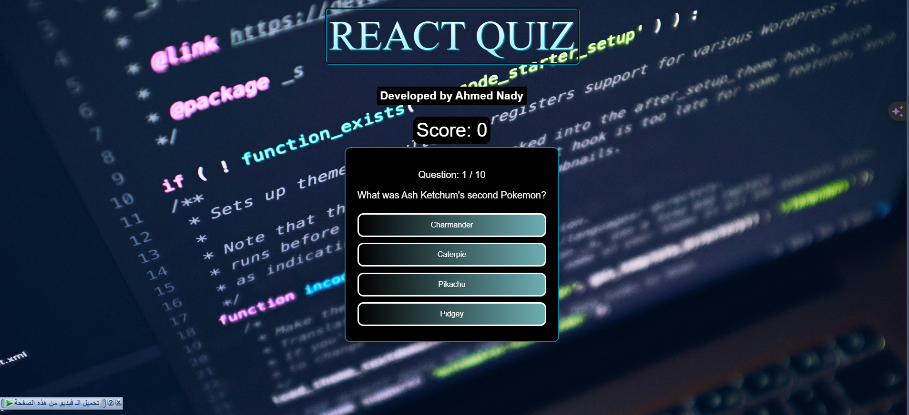

# React Quiz WebApp

## Overview

**React Quiz WebApp** is a responsive and interactive quiz application built with React and TypeScript.

## Screenshot

 <!-- Replace with the actual path to your screenshot -->

## Features

- **Topic Selection**: Users can choose from a variety of quiz topics.
- **Interactive Questions**: Real-time feedback is provided for each answer.
- **Final Score**: Users can view their final score at the end of the quiz.
- **Responsive Design**: Fully responsive design ensuring a seamless experience on any device.
- **Customizable**: Easily customize quiz topics, questions, and UI components.

## Installation

To get started with React Quiz WebApp, follow these steps:

1. Clone the repository:
    ```bash
    git clone https://github.com/your-username/react-quiz-webapp.git
    ```

2. Navigate to the project directory:
    ```bash
    cd react-quiz-webapp
    ```

3. Install the required dependencies:
    ```bash
    npm install
    ```

    or

    ```bash
    yarn install
    ```

4. Start the development server:
    ```bash
    npm start
    ```

    or

    ```bash
    yarn start
    ```

5. Access the application by navigating to `http://localhost:3000` in your web browser.

## Usage

Once the development server is running, you can explore the quiz application by choosing topics and answering questions. The app provides real-time feedback and displays the final score at the end of each quiz.

## Contributing

Contributions to the React Quiz WebApp are welcome! If you'd like to contribute, please follow these steps:

1. Fork the repository.
2. Create a new branch for your feature or bug fix.
3. Commit your changes and push to your fork.
4. Open a pull request with a detailed description of your changes.

## Contact

For any questions or feedback, please reach out to [nadyahmd88@gmail.com](nadyahmd88@gmail.com). 